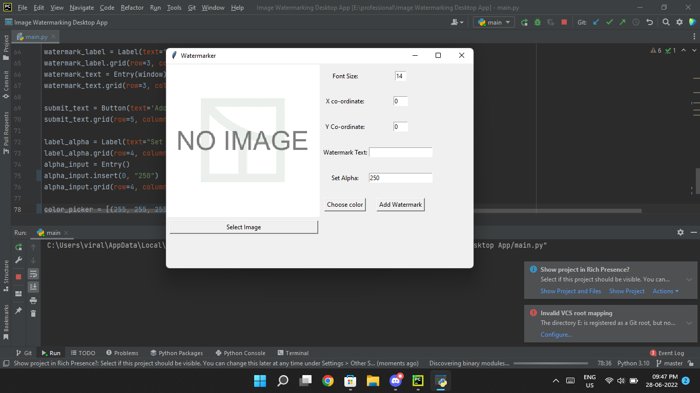

# Image Watermarking Desktop App
Its GUI Based Desktop App that i tried to made using tkinter, However Its not Perfect But it was good for Practice Purpose

## Run Script
```
git clone https://github.com/viralRupani/Watermarker
cd Watermarker
python main.py
```

## Example



